# Awesome-Natural-Language-Understanding 🧠 💬

  

  
  
  
  
  
  

---

## 🌟 Top Natural Language Understanding Ecosystem

**Curated Directory of Commercial NLU APIs & Open-Source NLP Libraries**  
*Focused on Intent Recognition, Entity Extraction, Sentiment Analysis, Semantic Parsing & Transformer Models*  

**Last updated: October 2026** 📅

---

### 📌 Overview & SEO Summary
Welcome to the ultimate curated directory of **natural language understanding (NLU) platforms**, **open-source NLP libraries**, and **transformer-based language models**. Natural Language Understanding is a critical subfield of Artificial Intelligence (AI) and Natural Language Processing (NLP) enabling machines to parse sentiment, extract named entities (NER), recognize user intent, perform semantic search, and synthesize contextual text. Whether you are searching for enterprise-grade commercial NLU services (such as *Microsoft Azure AI Language*, *Google Cloud Natural Language*, *AWS Comprehend*, and *IBM Watson NLU*), or high-performance open-source frameworks (like *Hugging Face Transformers*, *spaCy*, *NLTK*, *Stanza*, and *Flair*), this comprehensive resource indexes category leaders, foundational toolkits, and state-of-the-art model hubs.

---

## 📑 Table of Contents
- [🏢 SaaS & Commercial Platforms](#-saas--commercial-platforms)
- [🔓 Open-Source GitHub Projects](#-open-source-github-projects)
- [🛠️ How to Contribute](#%EF%B8%8F-how-to-contribute)
- [📊 Star History](#-star-history)
- [🤝 Support & Sponsorship](#-support--sponsorship)
- [⚠️ Disclaimer](#%EF%B8%8F-disclaimer)

---

## 🏢 SaaS & Commercial Platforms

The global Natural Language Understanding (NLU) market size is estimated at **$15.8 Billion in 2026** and is projected to reach **$48.5 Billion by 2030**, growing at a CAGR of ~32.4%. The market is **moderately concentrated** at the infrastructure layer, dominated by hyperscale cloud vendors (Microsoft, Google, AWS, IBM) who leverage massive cloud distribution and LLM foundations, while remaining **fragmented** in specialized verticals (e.g., news intelligence, symbolic hybrid AI, multi-lingual text analytics) where boutique vendors compete on domain accuracy and strict data governance.

| SaaS / Commercial Platform | Company / Owner | Market Cap / Valuation | Standard Edition Starting Price | Free Tier / Free Trial Limits | Description |
| :--- | :--- | :--- | :--- | :--- | :--- |
| **[Microsoft Azure AI Language (LUIS)](https://azure.microsoft.com/en-us/products/ai-services/ai-language)** 🧠 | Microsoft | ~$3.8 Trillion | $1.00 per 1,000 text records (S0 Tier) | Free F0 Tier: 5,000 text records/month + 1,000 test predictions | **Enterprise NLU with intent & entity extraction** — LUIS features migrated to unified Azure AI Language service. |
| **[Google Cloud Natural Language](https://cloud.google.com/natural-language)** 🌐 | Google (Alphabet) | ~$2.0 Trillion | $1.00 per 1,000 units (1 unit = 1,000 chars) | 5,000 units/month free per feature + $300 new customer credits | **Pre-trained NLU API** — sentiment analysis, entity extraction, content classification, syntax parsing. |
| **[AWS Comprehend](https://aws.amazon.com/comprehend/)** ☁️ | Amazon | ~$2.0 Trillion | $0.0001 per unit (1 unit = 100 characters, min 3 units) | 12-Month Free Tier: 50,000 units/month for standard entities, sentiment & keyphrases | **Fully managed NLP service** — sentiment, entities, key phrases, language detection, topic modeling. |
| **[IBM Watson Natural Language Understanding](https://www.ibm.com/products/natural-language-understanding)** 🔵 | IBM | ~$200 Billion | $0.003 per NLU item (Standard Plan) | Free Lite Tier: 30,000 NLU items/month + 1 custom model | **Enterprise NLU with governance focus** — targets regulated industries with Watsonx integration. |
| **[MonkeyLearn](https://monkeylearn.com/)** 🐒 | Medallia (Acquired 2022) | ~$7.5 Billion (Parent Medallia valuation) | $299/month (Team Plan including 10,000 queries) | Free Trial: 14 days access with 300 total queries | **No-code text analysis** — pre-built classifiers for sentiment, intent, and custom model training. |
| **[Aylien (Quantexa News API)](https://aylien.com/)** 📰 | Quantexa | ~$1.8 Billion | $499/month (Developer Plan starting tier) | Free Trial: 14-day full platform trial with 1,000 API calls | **News intelligence NLU** — media monitoring, entity extraction, and news-specific sentiment. |
| **[Expert.ai](https://www.expert.ai/)** 🎯 | Expert.ai S.p.A. | ~$80 Million (€70M) | $0.002 per text document analyzed (Standard API) | Free Developer Account: 14 days access with 2,500 requests limit | **Hybrid AI (symbolic + ML)** — focuses on explainability for insurance, banking, and life sciences. |
| **[Rosette](https://www.rosette.com/)** 🌹 | Basis Technology | ~$50 Million (Estimated Private) | $250/month (Developer API Starter) | Free Trial: 30-day developer key with 10,000 calls limit | **Multilingual text analytics** — 20-40 language support, entity extraction, sentiment, and morphology. |

---

## 🔓 Open-Source GitHub Projects

*Sorted by GitHub_Stars_Count (Descending)* 🌟

- **[Scikit-learn](https://github.com/scikit-learn/scikit-learn)**  ⚡  
  **Classic machine learning library**, BSD-3-Clause licensed. Foundational for traditional text classification, clustering, and feature extraction with TF-IDF and CountVectorizer. 📊

- **[Transformers (Hugging Face)](https://github.com/huggingface/transformers)**  ⚡  
  **State-of-the-art NLP library with 100K+ pretrained models**, Apache-2.0 licensed. The de facto standard for leveraging BERT, GPT, T5, and other transformer architectures for NLU tasks. 🤗

- **[BERT (Google Research)](https://github.com/google-research/bert)**  ⚡  
  **Bidirectional Encoder Representations from Transformers**, Apache-2.0 licensed. The foundational pretrained language model that revolutionized NLU. 🔷

- **[spaCy](https://github.com/explosion/spaCy)**  ⚡  
  **Industrial-strength NLP in Python**, MIT licensed. Production-grade entity recognition, part-of-speech tagging, dependency parsing, and text classification with pre-trained pipelines for 20+ languages. ⚡

- **[NLTK](https://github.com/nltk/nltk)**  ⚡  
  **The classic Python NLP toolkit**, Apache-2.0 licensed. Foundational library for tokenization, stemming, tagging, parsing, and semantic reasoning — widely used in education and research. 📚

- **[Rasa](https://github.com/RasaHQ/rasa)**  ⚡  
  **Open-source conversational AI framework**, Apache-2.0 licensed. Intent recognition, entity extraction, and dialogue management for building contextual assistants. 💬

- **[Gensim](https://github.com/piskvorky/gensim)**  ⚡  
  **Topic modeling and document similarity**, LGPL-2.1 licensed. Efficient implementations of Word2Vec, Doc2Vec, LDA, and LSI for semantic understanding. 🧩

- **[Sentence Transformers](https://github.com/UKPLab/sentence-transformers)**  ⚡  
  **Dense vector representations for sentences**, Apache-2.0 licensed. Enables semantic textual similarity, clustering, and semantic search with transformer embeddings. 🎯

- **[Haystack (Deepset)](https://github.com/deepset-ai/haystack)**  ⚡  
  **NLP framework for semantic search and QA**, Apache-2.0 licensed. End-to-end pipelines for retrieval-augmented generation (RAG) and document understanding. 🔍

- **[TextBlob](https://github.com/sloria/TextBlob)**  ⚡  
  **Simplified text processing in Python**, MIT licensed. Beginner-friendly API for sentiment analysis, noun phrase extraction, and translation built on NLTK and Pattern. 📝

- **[Flair](https://github.com/flairNLP/flair)**  ⚡  
  **Contextual string embeddings for sequence labeling**, MIT licensed. State-of-the-art NER, part-of-speech tagging, and text classification with simple Python APIs. 🔥

- **[Stanza (Stanford NLP)](https://github.com/stanfordnlp/stanza)**  ⚡  
  **Official Stanford NLP Python library**, Apache-2.0 licensed. Tokenization, multi-word token expansion, lemmatization, POS tagging, and dependency parsing for 70+ languages. 🎓

- **[CoreNLP (Stanford)](https://github.com/stanfordnlp/CoreNLP)**  ⚡  
  **Java NLP toolkit from Stanford**, GPL-3.0 licensed. Comprehensive pipeline for tokenization, parsing, NER, coreference resolution, and sentiment. ☕

- **[AllenNLP](https://github.com/allenai/allennlp)**  ⚡  
  **Deep learning for NLP research**, Apache-2.0 licensed. Modular framework from AI2 for building and evaluating NLU models with reproducible experiments. 🔬

- **[Snorkel](https://github.com/snorkel-team/snorkel)**  ⚡  
  **Programmatic training data creation**, Apache-2.0 licensed. Weak supervision framework for building NLU models without large labeled datasets. 🏷️

- **[Pattern](https://github.com/clips/pattern)**  ⚡  
  **Web mining and NLP module**, BSD-3-Clause licensed. Part-of-speech tagging, sentiment analysis, and vector space modeling with a focus on social media text. 🕸️

- **[FARM (Deepset)](https://github.com/deepset-ai/FARM)**  ⚡  
  **Framework for Adapting Representation Models**, Apache-2.0 licensed. Simplifies transfer learning for NLU tasks like question answering and intent classification. 🚜

- **[OpenNLP (Apache)](https://github.com/apache/opennlp)**  ⚡  
  **Apache machine learning based NLP toolkit**, Apache-2.0 licensed. Java library for sentence detection, tokenization, POS tagging, and named entity recognition. 🏛️

- **[Polyglot](https://github.com/aboSamoor/polyglot)**  ⚡  
  **Multilingual NLP pipeline**, GPL-3.0 licensed. Supports 40+ languages for NER, POS tagging, sentiment, and morphological analysis. 🌍

- **[HanLP](https://github.com/hankcs/HanLP)**  ⚡  
  **Multilingual NLP Library for Deep Learning & Classical Models**, Apache-2.0 licensed. State-of-the-art tokenization, POS tagging, and NER for Asian and European languages. 🧧

- **[Jieba](https://github.com/fxsjy/jieba)**  ⚡  
  **Chinese text segmentation module**, MIT licensed. Standard tool for Chinese word segmentation, keyword extraction, and speech tagging. 🔪

- **[fastText (Meta)](https://github.com/facebookresearch/fastText)**  ⚡  
  **Efficient text classification and representation library**, MIT licensed. Fast text representation learning and language identification. ⚡

---

## 🛠️ How to Contribute

Contributions are welcome! Follow these steps to submit new NLU platforms or open-source NLP software:

1. 🍴 **Fork** the repository.
2. 📝 **Add/edit** entries in `README.md` maintaining table/list structure and formatting.
3. 🔗 Include project title, official website/GitHub link, exact Stars_Count, license, and brief description.
4. 🚀 Submit a **Pull Request** with a descriptive summary of your changes.

---

## 📊 Star History

---

## 🤝 Support & Sponsorship

If you find this natural language understanding repository useful, please consider supporting the project:

- ⭐ **Star** this repository to increase visibility!
- 🔀 **Fork** and share with fellow developers & researchers.
- ☕ **Sponsor & Buy Me a Coffee**: Support ongoing open-source curation via the [GitHub Sponsor Dashboard](https://github.com/sponsors/ishandutta2007).

---

## ⚠️ Disclaimer

- This is a **community-curated** list — not exhaustive and not an endorsement. ℹ️
- NLU models and APIs process potentially sensitive text data. **Review privacy policies** and data handling practices before production use. 🔒
- Open-source NLP libraries offer powerful foundations for building custom NLU systems, but enterprise-grade SLA guarantees, compliance certifications, and vendor support remain primarily commercial offerings. 🧠

---

  <b>Made with ❤️ for NLP enthusiasts, AI researchers, and open-source language developers.</b>

